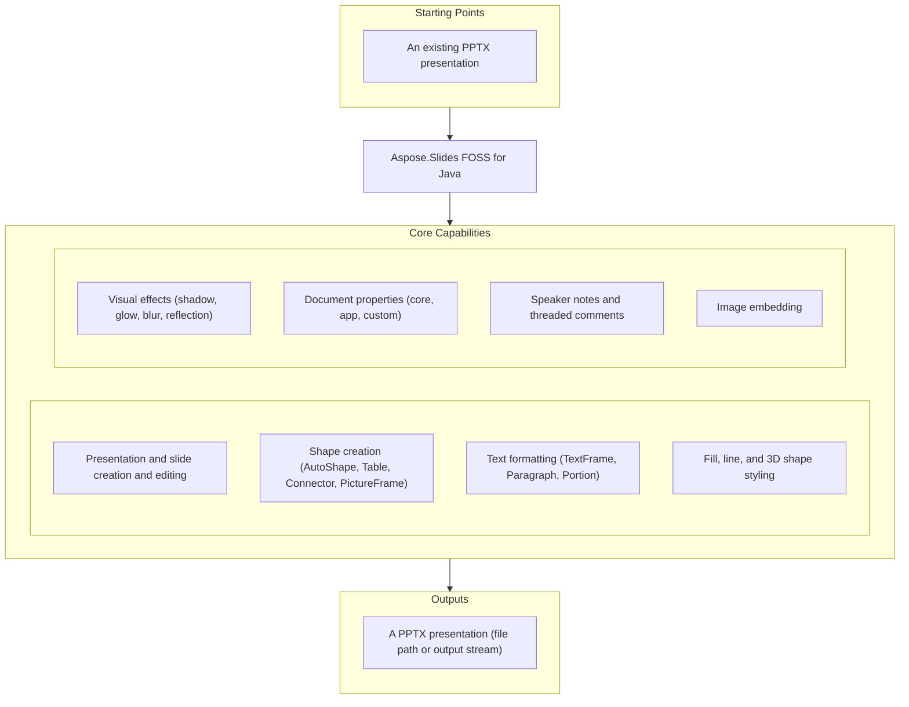

# Aspose.Slides FOSS for Java

[](https://central.sonatype.com/artifact/org.aspose/aspose-slides-foss) [](https://github.com/aspose-slides-foss/Aspose.Slides-FOSS-for-Java/blob/main/LICENSE) [](https://github.com/aspose-slides-foss/Aspose.Slides-FOSS-for-Java) [](https://github.com/aspose-slides-foss/Aspose.Slides-FOSS-for-Java/actions/workflows/maven-central-release.yml) [](https://github.com/aspose-slides-foss/Aspose.Slides-FOSS-for-Java/graphs/contributors)

[](https://products.aspose.org/slides/java/)

Aspose.Slides FOSS for Java is a free, open-source, pure-Java library for creating, reading, and editing PowerPoint `.pptx` presentations. The `Presentation` class is the root of the object model — it owns slides, shapes, images, comment authors, and document properties — and every operation runs without Microsoft Office, COM automation, or any proprietary runtime. Unknown XML content encountered while loading a presentation is never silently discarded on save. The sections below walk through its core features, installation, and full API surface.

## Navigation

- [At a Glance](#at-a-glance)
- [Key Capabilities](#key-capabilities)
- [Installation](#installation)
- [Dependencies](#dependencies)
- [Quick Start](#quick-start)
- [Additional Examples](#additional-examples)
- [API Reference](#api-reference)
- [Documentation & Resources](#documentation--resources)
- [Scope and Limitations](#scope-and-limitations)
- [Development and Testing](#development-and-testing)
- [License](#license)

## At a Glance



## Key Capabilities

- The `Presentation` class is the root of the object model, implements `AutoCloseable`, and is always used inside a try-with-resources block; open an existing `.pptx` with `new Presentation(path)` or start empty with `new Presentation()`, then persist it with `save(path, SaveFormat.PPTX)` or `save(stream, SaveFormat.PPTX)`.
- Add, remove, and clone slides through `SlideCollection`'s `addClone()`, `addEmptySlide()`, `insertEmptySlide()`, and `removeAt()` methods, iterate `getSlides()` directly, and control per-slide visibility during a slideshow with `ISlide.setHidden()`/`isHidden()`.
- Insert AutoShapes, PictureFrames, Tables, and Connectors via `ShapeCollection`'s `addAutoShape()`, `addPictureFrame()`, `addTable()`, and `addConnector()` methods, each returning a real `IShape`-derived object.
- Format text at the `TextFrame`, `Paragraph`, and `Portion` level, applying character, paragraph, and frame-level text formatting, including bullet styling via `BulletFormat`.
- Apply solid, gradient, pattern, and picture fills via `FillFormat` and `FillType`, and adjust line width, dash style, cap and join style, and arrowhead style, width, and length through `LineFormat`.
- `EffectFormat` supports outer shadow, inner shadow, glow, blur, soft edge, and reflection effects for any shape via `enableOuterShadowEffect()`, `enableGlowEffect()`, and the other `enable*Effect()`/`disable*Effect()` pairs.
- `ThreeDFormat` adds bevel, camera, light-rig, material, and extrusion-depth 3D properties to a shape via `ShapeBevel`, `ICamera`, and `ILightRig`, reached through `Shape.getThreeDFormat()`.
- Threaded comments support multiple `CommentAuthor` authors with real timestamps and slide positions via `CommentCollection.addComment()`.
- Per-slide `NotesSlide` objects, managed through `NotesSlideManager`, hold speaker notes with header and footer management via `addNotesSlide()` and `getNotesTextFrame()`.
- `DocumentProperties` exposes core, app, and custom document properties — title, author, subject, keywords, and arbitrary custom property values via `setCustomPropertyValue()`.
- Embed images from a file, raw bytes, or an input stream via `ImageCollection.addImage()`, then place them on a slide with `addPictureFrame()`.
- Unknown XML parts encountered while loading a presentation are preserved verbatim on save, so round-tripping a `.pptx` file never strips content this library doesn't yet parse.

## Installation

`aspose-slides-foss` is published on Maven Central as `org.aspose:aspose-slides-foss:26.7.0`.

**Maven:**

```xml
<dependency>
    <groupId>org.aspose</groupId>
    <artifactId>aspose-slides-foss</artifactId>
    <version>26.7.0</version>
</dependency>
```

**Gradle:**

```groovy
implementation 'org.aspose:aspose-slides-foss:26.7.0'
```

JDK 21 or later is required, and the library has no runtime dependencies beyond the JDK itself.

## Dependencies

### Required Package Dependencies

No required third-party package dependencies.

### Development Dependencies

- [`org.junit.jupiter:junit-jupiter-api`](https://central.sonatype.com/artifact/org.junit.jupiter/junit-jupiter-api) `5.11.4`
- [`org.junit.jupiter:junit-jupiter-engine`](https://central.sonatype.com/artifact/org.junit.jupiter/junit-jupiter-engine) `5.11.4`
- [`org.junit.jupiter:junit-jupiter-params`](https://central.sonatype.com/artifact/org.junit.jupiter/junit-jupiter-params) `5.11.4`
- [`org.assertj:assertj-core`](https://central.sonatype.com/artifact/org.assertj/assertj-core) `3.27.3`

## Quick Start

Create a presentation, add a rectangle `AutoShape`, apply a solid fill, and save it as `.pptx`:

```java
import org.aspose.slides.foss.Presentation;
import org.aspose.slides.foss.ShapeType;
import org.aspose.slides.foss.FillType;
import org.aspose.slides.foss.IAutoShape;
import org.aspose.slides.foss.ISlide;
import org.aspose.slides.foss.drawing.Color;
import org.aspose.slides.foss.export.SaveFormat;

try (Presentation pres = new Presentation()) {
    ISlide slide = pres.getSlides().get(0);
    slide.getShapes().clear();

    IAutoShape shape = slide.getShapes().addAutoShape(ShapeType.RECTANGLE, 50, 50, 200, 100);
    shape.getFillFormat().setFillType(FillType.SOLID);
    shape.getFillFormat().getSolidFillColor().setColor(Color.fromArgb(255, 0, 128, 255));

    pres.save("shapes.pptx", SaveFormat.PPTX);
}
```

## Additional Examples

Beyond basic shape creation, the integration test suite exercises connectors, comments, notes, document properties, effects, and images end to end (create, save, reopen, re-verify). The flagship example below wires two shapes together with a connector; more usage examples are collapsed below it.

Connect two shapes with a bent connector, choosing a specific connection site on each end:

```java
import org.aspose.slides.foss.*;
import org.aspose.slides.foss.export.SaveFormat;

try (Presentation pres = new Presentation()) {
    ISlide slide = pres.getSlides().get(0);
    slide.getShapes().clear();

    IAutoShape s1 = slide.getShapes().addAutoShape(ShapeType.RECTANGLE, 50, 50, 100, 60);
    IAutoShape s2 = slide.getShapes().addAutoShape(ShapeType.RECTANGLE, 350, 200, 100, 60);
    IConnector conn = slide.getShapes().addConnector(ShapeType.BENT_CONNECTOR3, 0, 0, 1, 1);

    conn.setStartShapeConnectedTo(s1);
    conn.setStartShapeConnectionSiteIndex(3);
    conn.setEndShapeConnectedTo(s2);
    conn.setEndShapeConnectionSiteIndex(1);

    pres.save("connector.pptx", SaveFormat.PPTX);
}
```

<details>
<summary>View Additional Examples</summary>

**Threaded comments:**

```java
import org.aspose.slides.foss.*;
import org.aspose.slides.foss.drawing.PointF;
import org.aspose.slides.foss.export.SaveFormat;

import java.time.LocalDateTime;

try (Presentation pres = new Presentation()) {
    ICommentAuthor author = pres.getCommentAuthors().addAuthor("Alice", "A");
    ISlide slide = pres.getSlides().get(0);
    LocalDateTime now = LocalDateTime.of(2026, 1, 15, 12, 0, 0);
    IComment comment = author.getComments().addComment("Review note", slide,
            new PointF(2.0f, 3.0f), now);

    pres.save("comments.pptx", SaveFormat.PPTX);
}
```

**Document properties:**

```java
import org.aspose.slides.foss.*;
import org.aspose.slides.foss.export.SaveFormat;

try (Presentation pres = new Presentation()) {
    IDocumentProperties props = pres.getDocumentProperties();
    props.setTitle("My Presentation");
    props.setSubject("Demo Subject");
    props.setAuthor("John Doe");
    props.setKeywords("demo, test");
    props.setCategory("Examples");

    pres.save("properties.pptx", SaveFormat.PPTX);
}
```

**Outer shadow effect:**

```java
import org.aspose.slides.foss.*;
import org.aspose.slides.foss.drawing.Color;
import org.aspose.slides.foss.export.SaveFormat;

try (Presentation pres = new Presentation()) {
    ISlide slide = pres.getSlides().get(0);
    slide.getShapes().clear();
    IAutoShape shape = slide.getShapes().addAutoShape(ShapeType.RECTANGLE, 100, 100, 200, 100);

    IEffectFormat ef = shape.getEffectFormat();
    ef.enableOuterShadowEffect();
    IOuterShadow shadow = ef.getOuterShadowEffect();
    shadow.setBlurRadius(10);
    shadow.setDirection(315);
    shadow.setDistance(8);
    shadow.getShadowColor().setColor(Color.fromArgb(128, 0, 0, 0));

    pres.save("shadow.pptx", SaveFormat.PPTX);
}
```

**Speaker notes:**

```java
import org.aspose.slides.foss.*;
import org.aspose.slides.foss.export.SaveFormat;

try (Presentation pres = new Presentation()) {
    ISlide slide = pres.getSlides().get(0);
    INotesSlide notes = slide.getNotesSlideManager().addNotesSlide();
    notes.getNotesTextFrame().setText("Speaker notes");

    pres.save("notes.pptx", SaveFormat.PPTX);
}
```

**Embed an image as a picture frame:**

```java
import org.aspose.slides.foss.*;
import org.aspose.slides.foss.export.SaveFormat;

try (Presentation pres = new Presentation()) {
    IPPImage img = pres.getImages().addImage(imageBytes);
    pres.getSlides().get(0).getShapes().addPictureFrame(
            ShapeType.RECTANGLE, 50, 50, 100, 100, img);

    pres.save("picture.pptx", SaveFormat.PPTX);
}
```

**Clone a slide:**

```java
import org.aspose.slides.foss.*;

try (Presentation pres = new Presentation()) {
    ISlide slide = pres.getSlides().get(0);
    slide.getShapes().addAutoShape(ShapeType.RECTANGLE, 50, 50, 200, 100);
    pres.getSlides().addClone(slide);
    // pres.getSlides().size() is now 2
}
```

**Open an existing presentation:**

```java
import org.aspose.slides.foss.Presentation;
import java.nio.file.Path;

try (Presentation pres = new Presentation(Path.of("Presentation.pptx").toString())) {
    // pres.getSlides().size() reflects the real slide count in the file
}
```

**Save to an in-memory stream:**

```java
import org.aspose.slides.foss.Presentation;
import org.aspose.slides.foss.export.SaveFormat;
import java.io.ByteArrayOutputStream;

try (Presentation pres = new Presentation()) {
    ByteArrayOutputStream buf = new ByteArrayOutputStream();
    pres.save(buf, SaveFormat.PPTX);
}
```

**Format a text portion (font size, bold, color):**

```java
import org.aspose.slides.foss.*;
import org.aspose.slides.foss.drawing.Color;
import org.aspose.slides.foss.export.SaveFormat;

try (Presentation pres = new Presentation()) {
    IAutoShape shape = pres.getSlides().get(0).getShapes()
            .addAutoShape(ShapeType.RECTANGLE, 50, 50, 400, 150);
    shape.addTextFrame("Formatted text");
    IPortionFormat fmt = shape.getTextFrame().getParagraphs().get(0)
            .getPortions().get(0).getPortionFormat();
    fmt.setFontHeight(24);
    fmt.setFontBold(NullableBool.TRUE);
    fmt.getFillFormat().setFillType(FillType.SOLID);
    fmt.getFillFormat().getSolidFillColor().setColor(Color.fromArgb(255, 0, 70, 127));

    pres.save("text.pptx", SaveFormat.PPTX);
}
```

**Create a table and set cell text:**

```java
import org.aspose.slides.foss.*;
import org.aspose.slides.foss.export.SaveFormat;

try (Presentation pres = new Presentation()) {
    ITable table = pres.getSlides().get(0).getShapes()
            .addTable(50, 50, new double[]{120, 120, 120}, new double[]{40, 40});
    table.getRows().get(0).get(0).getTextFrame().setText("Name");
    table.getRows().get(0).get(1).getTextFrame().setText("Value");

    pres.save("table.pptx", SaveFormat.PPTX);
}
```

</details>

## API Reference

The primary entry point is `Presentation`, which owns an `ISlideCollection` of `Slide` objects; each slide exposes an `IShapeCollection` of `Shape`-derived objects (`AutoShape`, `Connector`, `Table`, `PictureFrame`) built through `ShapeCollection`'s `addAutoShape()`, `addConnector()`, `addTable()`, and `addPictureFrame()` methods.

<details>
<summary>View the Core API Surface</summary>

### Foss

| Class | Description |
|---|---|
| `AdjustValue` | Represents a single geometry adjustment value backed by an OOXML `` element. |
| `AdjustValueCollection` | Represents a collection of shape's adjustments backed by an OOXML `` element. |
| `AutoShape` | Represents an AutoShape. |
| `BaseHandoutNotesSlideHeaderFooterManager` | Represents abstract base class for handout and notes slide header/footer managers. |
| `BasePortionFormat` | Common text portion formatting properties. |
| `BaseShapeLock` | Base class for shape locks. |
| `BaseSlide` | Represents common data for all slide types. |
| `Blur` | Represents a Blur effect that is applied to the entire shape, including its fill. |
| `BulletFormat` | Represents paragraph bullet formatting properties. |
| `Camera` | Represents 3D camera settings. |
| `Cell` | Represents a cell of a table. |
| `CellCollection` | Represents a collection of cells. |
| `CellFormat` | Represents format of a table cell. |
| `Color` | Immutable value type representing an ARGB color. |
| `ColorFormat` | Represents a color used in a presentation. |
| `Column` | Represents a column in a table. |
| `ColumnCollection` | Represents collection of columns in a table. |
| `ColumnFormat` | Represents formatting properties of a table column. |
| `Comment` | Represents a comment on a presentation slide. |
| `CommentAuthor` | Represents an author of comments. |
| `CommentAuthorCollection` | Represents a collection of comment authors in a presentation. |
| `CommentCollection` | Represents a collection of comments of one author. |
| `Connector` | Represents a connector shape. |
| `ConnectorLock` | Represents the lock settings for a connector shape. |
| `DocumentProperties` | Represents properties of a presentation. |
| `EffectFormat` | Represents effect formatting properties of a shape. |
| `FillFormat` | Represents fill formatting properties. |
| `FillOverlay` | Represents a Fill Overlay effect. |
| `GeometryShape` | Base class for shapes with geometry, backed by an OOXML shape element. |
| `GlobalLayoutSlideCollection` | Represents a collection of all layout slides in presentation. |
| `Glow` | Represents a glow effect backed by an OOXML `` element. |
| `GradientFormat` | Represents a gradient format. |
| `GradientStop` | Represents a single gradient stop. |
| `GradientStopCollection` | Represents a collection of gradient stops. |
| `GraphicalObject` | Abstract base class for graphical objects on a slide. |
| `GraphicalObjectLock` | Represents the lock settings for a graphical object shape. |
| `GroupShape` | Represents a group of shapes on a slide. |
| `HeadingPair` | Represents a heading pair indicating a grouping of document parts. |
| `Image` | Represents a raster or vector image. |
| `ImageCollection` | Represents a collection of images in a presentation. |
| `ImageTransformOperation` | Represents an image-transform operation applied to an image effect. |
| `Images` | Methods to instantiate and work with IImage. |
| `InnerShadow` | Represents an inner shadow effect backed by an OOXML `` element. |
| `LayoutSlide` | Represents a layout slide. |
| `LayoutSlideCollection` | Represents a collection of layout slides. |
| `LightRig` | Represents a light rig for 3D scene. |
| `LineFillFormat` | Represents the fill format of a line. |
| `LineFormat` | Represents format of a line. |
| `MasterLayoutSlideCollection` | Represents a collection of all layout slides of the defined master slide. |
| `MasterSlide` | Represents a master slide in a presentation. |
| `MasterSlideCollection` | Represents a collection of master slides in a presentation. |
| `NotesSize` | Represents the size of a notes slide. |
| `NotesSlide` | Represents a notes slide in a presentation. |
| `NotesSlideHeaderFooterManager` | Represents manager which holds behavior of the notes slide placeholders, including header placeholder. |
| `NotesSlideManager` | Manages the notes slide for a given slide. |
| `OuterShadow` | Represents an outer shadow effect backed by an OOXML `` element. |
| `PPImage` | Represents an image in a presentation. |
| `PVIObject` | Base class for property-value-inheritance (PVI) objects that are bound to a slide and presentation. |
| `Paragraph` | Represents a text paragraph. |
| `ParagraphCollection` | Represents a collection of paragraphs. |
| `ParagraphFormat` | Represents paragraph formatting properties. |
| `PatternFormat` | Represents a pattern fill format. |
| `Picture` | Represents a picture in a presentation. |
| `PictureFillFormat` | Represents a picture fill style. |
| `PictureFrame` | Represents a frame with a picture inside. |
| `PictureFrameLock` | Represents the locks for a PictureFrame. |
| `PointF` | Represents a 2D point with float coordinates. |
| `Portion` | Represents a text portion (run) within a paragraph. |
| `PortionCollection` | Represents a collection of text portions within a paragraph. |
| `PortionFormat` | Represents text portion formatting properties. |
| `PptCorruptFileException` | Exception thrown when a PPT file is corrupt and cannot be processed. |
| `PptException` | Base exception for PPT-related errors. |
| `PptReadException` | Exception thrown when a PPT file cannot be read. |
| `Presentation` | Represents a PowerPoint presentation. |
| `PresetShadow` | Represents a preset shadow effect backed by an OOXML `` element. |
| `RectangleF` | Represents a rectangle defined by position and size using floating-point coordinates. |
| `Reflection` | Represents a reflection effect backed by an OOXML `` element. |
| `Row` | Represents a row in a table. |
| `RowCollection` | Represents a collection of rows in a table. |
| `RowFormat` | Represents formatting properties of a table row. |
| `Shape` | Abstract base class for shapes on a slide. |
| `ShapeBevel` | Contains the properties of shape's main face relief (bevel). |
| `ShapeCollection` | Represents a collection of shapes on a slide. |
| `ShapeFrame` | Represents an immutable shape frame with position, size, rotation, and flip properties. |
| `ShapeStyle` | Represents a shape's style reference. |
| `Size` | Represents a 2D size with integer dimensions. |
| `SizeF` | Represents a 2D size with float dimensions. |
| `Slide` | Represents a slide in a presentation. |
| `SlideCollection` | Represents a collection of slides in a presentation. |
| `SoftEdge` | Represents a soft edge effect backed by an OOXML `` element. |
| `Table` | Represents a table shape on a slide. |
| `TableFormat` | Represents format of a table. |
| `TextFrame` | Represents a text frame containing paragraphs. |
| `TextFrameFormat` | Contains the TextFrame's formatting properties. |
| `ThreeDFormat` | Represents 3-D formatting properties for a shape. |

#### Interfaces

| Class | Description |
|---|---|
| `IAdjustValue` | Represents a geometry shape adjustment value. |
| `IAdjustValueCollection` | Represents a collection of shape adjustment values. |
| `IAutoShape` | Represents an AutoShape. |
| `IBaseHandoutNotesSlideHeaderFooterManager` | Represents base interface for handout and notes slide header/footer managers. |
| `IBaseHeaderFooterManager` | Represents base interface for header/footer managers. |
| `IBasePortionFormat` | Represents common text portion formatting properties. |
| `IBaseSlide` | Represents common data for all slide types. |
| `IBaseSlideHeaderFooterManager` | Represents base interface for slide header/footer managers that manage footer, slide number, and date-time placeholders. |
| `IBlur` | Represents a Blur effect that is applied to the entire shape, including its fill. |
| `IBulkTextFormattable` | Represents an object with the possibility of bulk setting child text elements' formats. |
| `IBulletFormat` | Represents paragraph bullet formatting properties. |
| `ICamera` | Represents Camera. |
| `ICell` | Represents a cell in a table. |
| `ICellCollection` | Represents a collection of cells. |
| `ICellFormat` | Represents format of a table cell. |
| `IColorFormat` | Represents a color used in a presentation. |
| `IColumn` | Represents a column in a table. |
| `IColumnCollection` | Represents collection of columns in a table. |
| `IColumnFormat` | Represents format of a table column. |
| `IComment` | Represents a comment on a presentation slide. |
| `ICommentAuthor` | Represents a comment author in a presentation. |
| `ICommentAuthorCollection` | Represents a collection of comment authors in a presentation. |
| `ICommentCollection` | Represents a collection of comments belonging to a single author. |
| `IConnector` | Represents a connector. |
| `IConnectorLock` | Determines which operations are disabled on the parent Connector. |
| `ICustomData` | Represents custom data associated with a shape. |
| `IDocumentProperties` | Represents properties of a presentation document. |
| `IEffectFormat` | Represents effect formatting properties. |
| `IEffectParamSource` | Marker interface for objects that serve as a source of effect parameters. |
| `IFillFormat` | Represents fill formatting options. |
| `IFillOverlay` | Represents a Fill Overlay effect. |
| `IFillParamSource` | Marker interface for objects that serve as a source of fill parameters. |
| `IFontData` | Represents a font definition. |
| `IGeometryShape` | Represents a shape with geometry (preset or custom). |
| `IGlobalLayoutSlideCollection` | Represents a collection of all layout slides in a presentation. |
| `IGlow` | Represents a glow effect applied to a shape. |
| `IGradientFormat` | Represents a gradient format. |
| `IGradientStop` | Represents a gradient stop. |
| `IGradientStopCollection` | Represents a collection of gradient stops. |
| `IGraphicalObject` | Represents abstract graphical object. |
| `IGraphicalObjectLock` | Determines which operations are disabled on the parent IGraphicalObject. |
| `IGroupShape` | Represents a group of shapes on a slide. |
| `IHeadingPair` | Represents a heading pair that indicates a grouping of document parts and the number of parts in each group. |
| `IHyperlinkContainer` | Marker interface for objects that contain hyperlinks. |
| `IImage` | Represents a raster or vector image. |
| `IImageCollection` | Represents a collection of images in a presentation. |
| `IImageTransformOperation` | Represents an image-transform operation effect. |
| `IInnerShadow` | Represents an inner shadow effect applied to a shape. |
| `ILayoutSlide` | Represents a layout slide. |
| `ILayoutSlideCollection` | Represents a base class for collection of a layout slides. |
| `ILightRig` | Represents a light rig. |
| `ILineFillFormat` | Represents properties for lines filling. |
| `ILineFormat` | Represents format of a line. |
| `ILineParamSource` | Marker interface for objects that serve as a source of line parameters. |
| `ILoadOptions` | Represents options that can be used to configure how a presentation is loaded. |
| `IMasterLayoutSlideCollection` | Represents a collection of layout slides belonging to a master slide. |
| `IMasterSlide` | Represents a master slide in a presentation. |
| `IMasterSlideCollection` | Represents a collection of master slides. |
| `INotesSize` | Represents a size of notes slide. |
| `INotesSlide` | Represents a notes slide in a presentation. |
| `INotesSlideHeaderFooterManager` | Represents manager which holds behavior of the notes slide placeholders, including header placeholder. |
| `INotesSlideManager` | Manages the notes slide for a given slide. |
| `IOuterShadow` | Represents an Outer Shadow effect. |
| `IPPImage` | Represents an image in a presentation. |
| `IParagraph` | Represents a text paragraph. |
| `IParagraphCollection` | Represents a collection of paragraphs. |
| `IParagraphFormat` | Represents paragraph formatting properties. |
| `IPatternFormat` | Represents a pattern fill format. |
| `IPictureFillFormat` | Represents a picture fill style. |
| `IPictureFrame` | Represents a frame with a picture inside. |
| `IPictureFrameLock` | Determines which operations are disabled on the parent IPictureFrame. |
| `IPlaceholder` | Represents a placeholder on a slide. |
| `IPortion` | Represents a portion of text inside a text paragraph. |
| `IPortionCollection` | Represents a collection of text portions. |
| `IPortionFormat` | Represents formatting properties of a text portion with no inheritance applied. |
| `IPresentation` | Represents a presentation document. |
| `IPresentationComponent` | Represents a component of a presentation. |
| `IPresetShadow` | Represents a Preset Shadow effect. |
| `IReflection` | Represents a reflection effect applied to a shape. |
| `IRow` | Represents a row in a table. |
| `IRowCollection` | Represents a collection of rows in a table. |
| `IRowFormat` | Represents format of a table row. |
| `ISaveOptions` | Options that control how a presentation is saved. |
| `ISection` | Represents a section in a presentation. |
| `IShape` | Represents a shape on a slide. |
| `IShapeBevel` | Represents properties of shape's main face relief. |
| `IShapeCollection` | Represents a collection of shapes. |
| `IShapeFrame` | Represents shape frame's properties. |
| `IShapeStyle` | Represents a shape's style reference. |
| `ISlide` | Represents a slide in a presentation. |
| `ISlideCollection` | Represents a collection of slides in a presentation. |
| `ISlideComponent` | Represents a component of a slide. |
| `ISlidesPicture` | Represents a picture in a presentation. |
| `ISoftEdge` | Represents a Soft Edge effect. |
| `ITable` | Represents a table on a slide. |
| `ITableFormat` | Represents format of a table. |
| `ITextFrame` | Represents a TextFrame. |
| `ITextFrameFormat` | Represents format of a text frame. |
| `IThemeable` | Represents objects that can be themed. |
| `IThreeDFormat` | Represents 3-D properties. |
| `IThreeDParamSource` | Marker interface for objects that serve as a source of 3D parameters. |

#### Enumerations

| Class | Description |
|---|---|
| `BevelPresetType` | Constants which define 3D bevel of shape. |
| `BulletType` | Represents the type of the extended bullets. |
| `CameraPresetType` | Constants which define camera preset type. |
| `ColorType` | Represents different color modes. |
| `FillBlendMode` | Determines blend mode. |
| `FillType` | Specifies the interior fill type of various visual objects. |
| `FontAlignment` | Represents vertical font alignment. |
| `GradientDirection` | Represents the gradient style. |
| `GradientShape` | Represents the shape of gradient fill. |
| `LightRigPresetType` | Constants which define light preset types. |
| `LightingDirection` | Constants which define light directions. |
| `LineAlignment` | Represents the lines alignment type. |
| `LineArrowheadLength` | Represents the length of an arrowhead. |
| `LineArrowheadStyle` | Represents the style of an arrowhead. |
| `LineArrowheadWidth` | Represents the width of an arrowhead. |
| `LineCapStyle` | Represents the line cap style. |
| `LineDashStyle` | Represents the line dash style. |
| `LineJoinStyle` | Represents the lines join style. |
| `LineStyle` | Represents the style of a line. |
| `MaterialPresetType` | Constants which define material of shape. |
| `NullableBool` | Represents triple boolean values. |
| `NumberedBulletStyle` | Represents the style of the numbered bullets. |
| `PatternStyle` | Represents the pattern style. |
| `PictureFillMode` | Determines how picture will fill area. |
| `PresetColor` | Represents predefined color presets. |
| `PresetShadowType` | Represents a preset for a shadow effect. |
| `RectangleAlignment` | Defines 2-dimension alignment. |
| `SaveFormat` | Constants which define the format of a saved presentation. |
| `SchemeColor` | Represents colors in a color scheme. |
| `ShapeType` | Represents preset geometry of geometry shapes. |
| `SlideLayoutType` | Represents the slide layout type. |
| `SourceFormat` | Represents source file format. |
| `TableStylePreset` | Represents builtin table styles. |
| `TextAlignment` | Represents different text alignment styles. |
| `TextAnchorType` | text box alignment within a text area. |
| `TextAutofitType` | Represents text autofit mode. |
| `TextCapType` | Represents the type of text capitalisation. |
| `TextShapeType` | Represents text wrapping shape. |
| `TextStrikethroughType` | Represents the type of text strikethrough. |
| `TextUnderlineType` | Represents the type of text underline. |
| `TextVerticalType` | Determines vertical writing mode for a text. |
| `TileFlip` | Defines tile flipping mode. |

---

#### Detailed Member Reference

- `Presentation` — the root object; owns slides, images, comment authors, and document properties.
  - `Presentation()`, `Presentation(path)`, `Presentation(in) -> Presentation`
  - `getSlides() -> ISlideCollection`, `getImages() -> IImageCollection`, `getCommentAuthors() -> ICommentAuthorCollection`
  - `getDocumentProperties() -> IDocumentProperties`, `getLayoutSlides() -> IGlobalLayoutSlideCollection`, `getMasters() -> IMasterSlideCollection`
  - `save(path, format) -> void`, `save(stream, format) -> void`, `dispose() -> void`
- `SlideCollection` — the real `ISlideCollection` implementation returned by `Presentation.getSlides()`.
  - `get(index) -> ISlide`, `size() -> int`, `addClone(sourceSlide) -> ISlide`, `addEmptySlide(layout) -> ISlide`, `insertEmptySlide(index, layout) -> ISlide`, `removeAt(index) -> void`, `indexOf(slide) -> int`
- `ShapeCollection` — the real `IShapeCollection` implementation returned by `Slide.getShapes()`.
  - `addAutoShape(shapeType, x, y, width, height) -> IAutoShape`, `addConnector(shapeType, x, y, width, height) -> IConnector`
  - `addTable(x, y, colWidths, rowHeights) -> ITable`, `addPictureFrame(shapeType, x, y, width, height, image) -> IPictureFrame`
  - `get(index) -> IShape`, `size() -> int`, `remove(shape) -> void`, `removeAt(index) -> void`, `clear() -> void`, `reorder(index, shape) -> void`
- `AutoShape` — a preset-geometry shape (rectangle, ellipse, and every other `ShapeType`).
  - `getShapeType() -> ShapeType`, `addTextFrame(text) -> ITextFrame`, `getTextFrame() -> ITextFrame`, `getFillFormat() -> IFillFormat`, `getLineFormat() -> ILineFormat`, `getEffectFormat() -> IEffectFormat`, `getThreeDFormat() -> IThreeDFormat`
- `Connector` — a shape-to-shape connector line.
  - `getStartShapeConnectedTo() -> IShape`, `setStartShapeConnectedTo(value) -> void`, `getEndShapeConnectedTo() -> IShape`, `setEndShapeConnectedTo(value) -> void`
  - `getStartShapeConnectionSiteIndex() -> int`, `setStartShapeConnectionSiteIndex(value) -> void`, `reroute() -> void`
- `Table` — a table shape on a slide.
  - `getRows() -> IRowCollection`, `getColumns() -> IColumnCollection`, `getTableFormat() -> ITableFormat`, `mergeCells(cell1, cell2, allowSplitting) -> ICell`
- `TextFrame` — the text content model for a shape's `addTextFrame()`/`getTextFrame()`.
  - `getParagraphs() -> IParagraphCollection`, `getText() -> String`, `setText(text) -> void`, `getTextFrameFormat() -> ITextFrameFormat`
- `ThreeDFormat` — 3-D formatting reached via `Shape.getThreeDFormat()`.
  - `getBevelTop() -> IShapeBevel`, `getBevelBottom() -> IShapeBevel`, `getCamera() -> ICamera`, `getLightRig() -> ILightRig`, `getMaterial() -> MaterialPresetType`, `getExtrusionHeight() -> double`, `getDepth() -> double`
- `EffectFormat` — visual effects reached via `Shape.getEffectFormat()`.
  - `enableOuterShadowEffect() -> void`, `getOuterShadowEffect() -> IOuterShadow`, `enableGlowEffect() -> void`, `getGlowEffect() -> IGlow`, `enableBlurEffect() -> void`, `enableSoftEdgeEffect() -> void`, `enableReflectionEffect() -> void`
- `FillFormat` — fill formatting reached via `Shape.getFillFormat()`.
  - `getFillType() -> FillType`, `setFillType(value) -> void`, `getSolidFillColor() -> IColorFormat`, `getGradientFormat() -> IGradientFormat`, `getPatternFormat() -> IPatternFormat`, `getPictureFillFormat() -> IPictureFillFormat`
- `CommentAuthor` — an author of threaded comments.
  - `getName() -> String`, `getInitials() -> String`, `getComments() -> ICommentCollection`
- `DocumentProperties` — reached via `Presentation.getDocumentProperties()`.
  - `getTitle() -> String`, `setTitle(value) -> void`, `getAuthor() -> String`, `setAuthor(value) -> void`, `getCustomPropertyValue(name, out) -> void`, `setCustomPropertyValue(name, value) -> void`
- `NotesSlideManager` — reached via `Slide.getNotesSlideManager()`.
  - `addNotesSlide() -> INotesSlide`, `getNotesSlide() -> INotesSlide`, `removeNotesSlide() -> void`
- `ImageCollection` — reached via `Presentation.getImages()`.
  - `addImage(imageData) -> IPPImage`, `addImage(stream) -> IPPImage`, `get(index) -> IPPImage`, `size() -> int`
- `LineFormat` — reached via `Shape.getLineFormat()`.
  - `getWidth() -> double`, `setWidth(value) -> void`, `getDashStyle() -> LineDashStyle`, `setDashStyle(value) -> void`, `getBeginArrowheadStyle() -> LineArrowheadStyle`, `getEndArrowheadStyle() -> LineArrowheadStyle`

</details>

## Documentation & Resources

- **[Getting started guide](https://docs.aspose.org/slides/java/)** — setup, core concepts, and step-by-step guides for Aspose.Slides FOSS for Java.
- **[How-to guides & FAQ](https://kb.aspose.org/slides/java/)** — task-focused how-to articles for common presentation operations.
- **[Full API reference](https://reference.aspose.org/slides/java/)** — the complete, browsable reference (the API Reference section above covers the essentials).
- **[Contributor guide](https://github.com/aspose-slides-foss/Aspose.Slides-FOSS-for-Java/blob/main/AGENTS.md)** — build commands, core concepts, and import patterns for working on the source.
- **[Publishing guide](PUBLISHING.md)** — how releases are built and published to Maven Central.
- Found a bug or have a feature request? [Open an issue](https://github.com/aspose-slides-foss/Aspose.Slides-FOSS-for-Java/issues) on GitHub.

## Scope and Limitations

The following capabilities are not implemented in this FOSS build:

- Charts, SmartArt, OLE objects, and mathematical text are not supported.
- Animations and slide transitions are not supported.
- Export to non-PPTX formats (PDF, HTML, SVG, images) is not available — `.pptx` is the only supported save format.
- VBA macros and digital signatures are not supported.
- Hyperlinks and action settings are not supported.
- `Presentation.save()` requires an explicit output path or stream — there's no overload that infers a destination from `ISaveOptions` alone.
- `Table.mergeCells()` requires an XML-backed table; it cannot merge cells on a table built without a backing OOXML element.
- The `save(path, format)`/`save(stream, format)` overloads accept a `SaveFormat` argument but do not validate it — passing anything other than `SaveFormat.PPTX` does not throw or report an error; the library silently writes a `.pptx`/OOXML package to the given destination regardless of the requested format.

These limitations don't apply to [Aspose.Slides for Java — Enterprise Edition](https://products.aspose.com/slides/java/), which adds full format export (PDF, HTML, XPS, images, and more), charts, animations, VBA macro support, and every other capability outside this FOSS build's scope.

## Development and Testing

Clone the repository and build with Maven (JDK 21 or later is required — the project has no runtime dependencies beyond the JDK):

```bash
mvn compile
mvn test
```

`mvn test` compiles and runs both the unit tests under `src/test/java` and the integration tests under `tests/integration`, wired in as an additional test source directory via the `build-helper-maven-plugin` (`pom.xml`). The integration suite exercises real save/reload round trips against `Presentation` for shapes, connectors, comments, notes, document properties, effects, fills, lines, and images, using fixture files under `tests/test_data/`.

Releases publish to Maven Central via
[`maven-central-release.yml`](.github/workflows/maven-central-release.yml) — see
[`PUBLISHING.md`](PUBLISHING.md) for the full release process.

## License

This project is licensed under the [MIT License](LICENSE). The MIT License permits use, copying, modification, distribution, sublicensing, and commercial use, provided its copyright and permission notice are retained. The software is provided without warranty.
